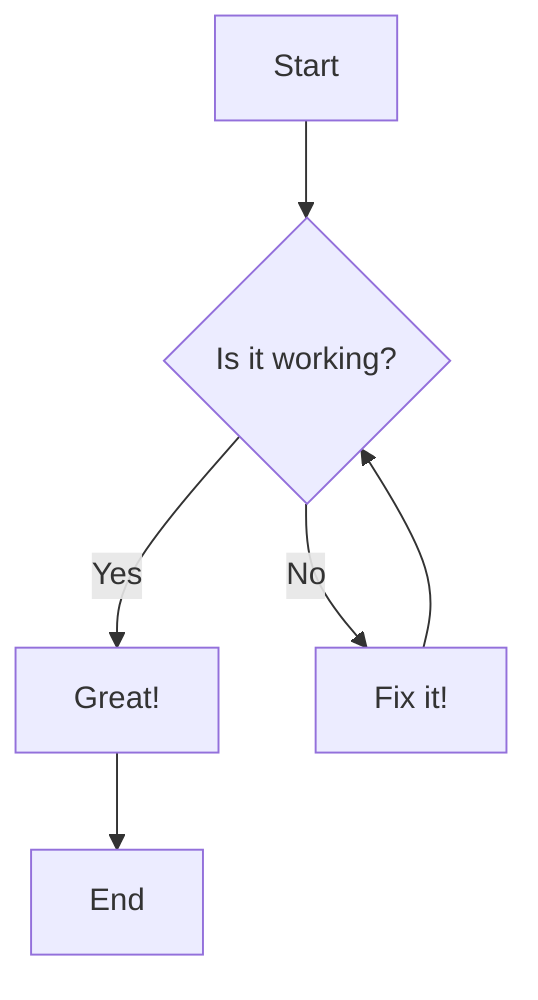

**Blog Goal: To understand deeper about the XGBoost algorithm** 

# XGBoost — eXtreme Gradient Boosting

XGBoost, which stands for **eXtreme Gradient Boosting**, is a powerhouse algorithm in the world of machine learning, especially for working with tabular data. It's known for its speed and performance, consistently winning data science competitions. But how does it actually work?

Let's pull back the curtain and break down XGBoost from the ground up. We'll explore the core concepts, walk through a manual calculation, and even build a simple version from scratch in Python.

---

## The Power of Teamwork: Ensemble Learning

At its heart, XGBoost is a form of **Ensemble Learning**. Ensemble Learning. The main idea is simple: instead of relying on a single model, we combine the predictions from multiple models to get a more accurate and robust result.

There are two main strategies for this:

**1. Bagging (Parallel):** Multiple models are trained independently on different subsets of the data. Their predictions are then averaged. This method is great at reducing a model's variance (i.e., its sensitivity to the training data). A classic example is the Random Forest.

**2. Boosting (Sequential):** Models are trained one after another. Each new model focuses on correcting the errors made by the previous ones. This method excels at reducing a model's bias (i.e., its underlying assumptions being wrong).

XGBoost is a high-performance implementation of **gradient boosting**. It builds a sequence of simple weak learners (usually shallow decision trees). Each tree tries to correct the residual errors of the ensemble so far.

---

## What Makes XGBoost “Extreme”?

XGBoost extends standard gradient boosting with several algorithmic and engineering improvements. One central idea is a more sophisticated **objective** that includes a complexity (regularization) term; another is use of a second-order Taylor expansion (both first and second derivatives) for faster and more accurate split decisions.

### Objective function

At iteration $t$ we want to add a new tree $$f_t$$ that minimizes the following objective:

$$
\mathcal{L}^{(t)} = \sum_{i=1}^{n} l\big(y_i, \hat{y}_i^{(t-1)} + f_t(x_i)\big) + \Omega(f_t)
$$

where:

- \(l(\cdot,\cdot)\) is the loss (e.g. squared error for regression).
- \(\hat{y}_i^{(t-1)}\) is the ensemble prediction up to iteration \(t-1\).
- \(f_t\) is the new tree added at iteration \(t\).
- \(\Omega(f)\) is a regularization term that penalizes tree complexity.

A commonly used tree regularizer in XGBoost is:

$$
\Omega(f) = \gamma T + \tfrac{1}{2} \lambda \sum_{j=1}^{T} w_j^2
$$

where:
- \(T\) is the number of leaves in the tree.
- \(w_j\) is the weight (score) of leaf \(j\).
- \(\gamma\) (gamma) penalizes adding more leaves.
- \(\lambda\) (lambda) penalizes large leaf weights.

### Second-order Taylor expansion

To find the best tree quickly, XGBoost uses a second-order Taylor expansion of the loss around the current predictions. Denote the first and second derivatives of the loss w.r.t.\ the prediction by:

- \(g_i = \left.\frac{\partial l(y_i, \hat{y}_i)}{\partial \hat{y}_i}\right|_{\hat{y}_i=\hat{y}_i^{(t-1)}}\) (gradient)
- \(h_i = \left.\frac{\partial^2 l(y_i, \hat{y}_i)}{\partial \hat{y}_i^2}\right|_{\hat{y}_i=\hat{y}_i^{(t-1)}}\) (Hessian)

Using these, XGBoost derives closed-form expressions for the **optimal leaf weight** and the **gain** from a potential split.

**Optimal leaf weight for leaf \(j\):**

$$
w_j^* = -\frac{\sum_{i\in I_j} g_i}{\sum_{i\in I_j} h_i + \lambda}
$$

where \(I_j\) is the set of samples that fall into leaf \(j\).

**Split gain (how valuable a split is):**

$$
\text{Gain} = \tfrac{1}{2}\left(\frac{G_L^2}{H_L + \lambda} + \frac{G_R^2}{H_R + \lambda} - \frac{(G_L + G_R)^2}{H_L + H_R + \lambda}\right) - \gamma
$$

Here \(G_L\) and \(H_L\) are the sums of gradients and Hessians in the left child, and \(G_R\), \(H_R\) for the right child. The split with the highest gain is chosen (if gain > 0, considering \(\gamma\)).

---

## XGBoost by Hand: A Regression Example

We will walk through one boosting iteration from the presentation example. The task: predict cholesterol (\(y\)) from age (\(X\)).

**Hyperparameters:** learning rate \(\eta=0.5\), \(\lambda=1.0\), \(\gamma=0.0\).

**Loss function:** Mean Squared Error (MSE):

$$
l(\hat{y}_i, y_i) = \tfrac{1}{2}(\hat{y}_i - y_i)^2
$$

(This form yields a convenient gradient and Hessian.)

**Data:**

| Age (X) | Chol (y) |
|:-------:|:--------:|
| 29      | 204      |
| 48      | 234      |
| 39      | 203      |
| 67      | 269      |
| 45      | 250      |
| 59      | 260      |

### Step 1 — Initial prediction

For MSE, the initial prediction \(F_0\) is the mean of the targets:

\[ F_0 = \frac{204 + 234 + 203 + 269 + 250 + 260}{6} = 236.67 \]

(rounded to 2 decimal places)

### Step 2 — Build the first tree (t = 1)

For MSE, the derivatives are simple:

- \(g_i = \hat{y}_i^{(t-1)} - y_i = F_0 - y_i\)
- \(h_i = 1\)

Sorted by age, the gradients (rounded) are:

| Age | Chol | $$g_i = F_0 - y_i$$ | \(h_i\) |
|:---:|:----:|:-------------------:|:-------:|
| 29  | 204  | 32.67               | 1       |
| 39  | 203  | 33.67               | 1       |
| 45  | 250  | -13.33              | 1       |
| 48  | 234  | 2.67                | 1       |
| 59  | 260  | -23.33              | 1       |
| 67  | 269  | -32.33              | 1       |

#### Consider split: Age \(\le 42\) (i.e. between 39 and 45)

- **Left node (Age \(\le 42\))**: samples with ages 29 and 39.
  - \(G_L = 32.6667 + 33.6667 = 66.33\)
  - \(H_L = 1 + 1 = 2\)

- **Right node (Age \(> 42\))**: samples with ages 45, 48, 59, 67.
  - \(G_R = -13.3333 + 2.6667 - 23.3333 - 32.3333 = -66.33\)
  - \(H_R = 4\)

Using the split gain formula with \(\lambda = 1.0\) and \(\gamma = 0.0\):

$$
\text{Gain} = 0.5\left(\frac{66.33^2}{2+1} + \frac{(-66.33)^2}{4+1} - \frac{(66.33-66.33)^2}{2+4+1}\right) \approx 1173.36
$$

(After checking all candidate splits, this split yields the highest gain in the example.)

#### Compute leaf weights

Use the optimal leaf-weight formula:

- Left leaf weight:

  $$
w_L = -\frac{G_L}{H_L + \lambda} = -\frac{66.33}{2 + 1} \approx -22.11
  $$

- Right leaf weight:

  $$
w_R = -\frac{G_R}{H_R + \lambda} = -\frac{-66.33}{4 + 1} \approx 13.27
  $$

